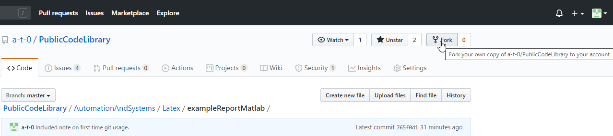
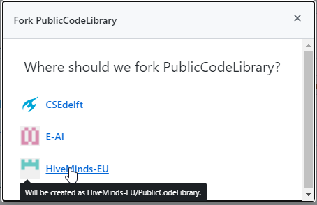
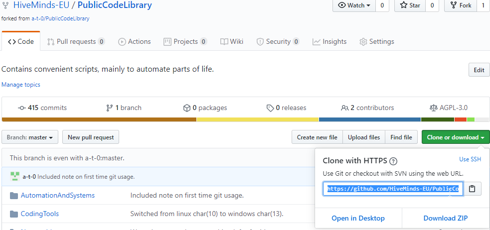
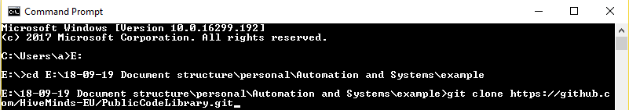
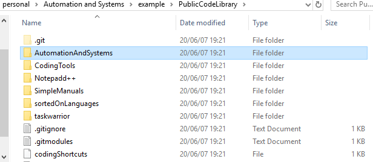
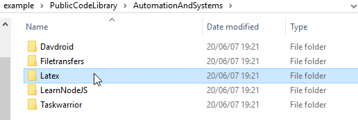
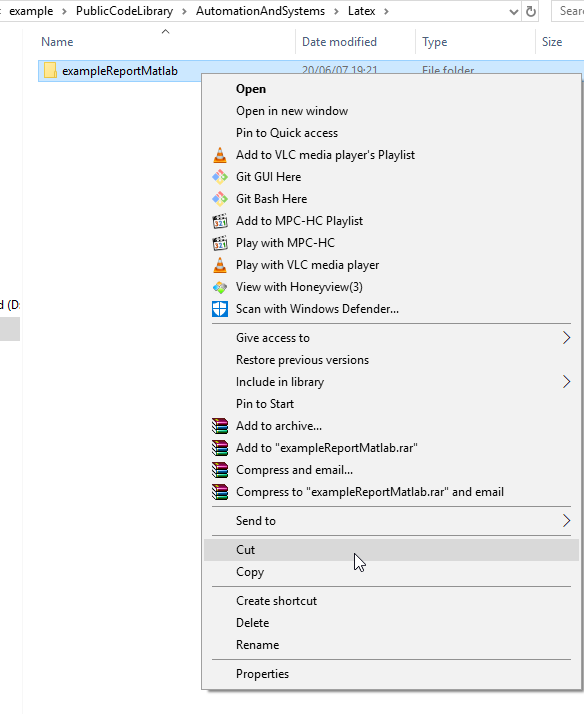
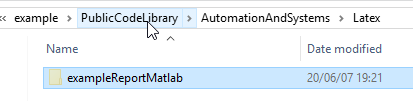
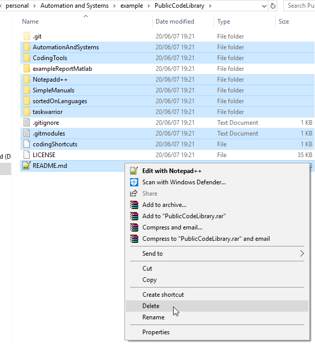

# What
This is a latex sample report which is syncred with git(hub). It (semi-)automatically syncs the code into your latex, and semi-automatically exports the plots into your report.

# Why
Personally I like how the integrated system allows one to colaborate on code, and get a neat and structured report, nice plots without having to copy paste things.

# How
0. Fork this repository:
0.a 
0.b 

1. Clone=download your fork of this repository:
1.a 
1.b 

2. Delete everything except this (parent) folder named `exampleReportMatlab`. (put it at the top of the repository, so basically in the same folder as the folder `AutomationsAndSAystems`:
2.a 
2.b 
2.c 
2.d 
2.e 
2.f 
2.g 
2.h 

3. Now you can do your first upload (called push) to github. 

3.a Note, first time you use github with command you probably need to login, but it'll ask you to do so if you need to.
3.b push your code to github by opening cmd, browsing into the directory of the repository with `cd` and use commands:
```
git status
```
3.c with that `git status` command you can see which files you changed, normally you add a particular file, but since it is a lot this time, you can also type `git add *` instead (instead of the git add commands below).

3.d Then upload your changes to your own repository with:
```
git pull
git add "some_folder/the_file_you_changed.py"
git add "some_other_folder/the_plot_you_created.jpeg"

git commit -m "Created a plot for something specific."
git push
```

4. if you want to work in overleaf: 
4.a Get a(n) (free) overleaf account.
4.b In: https://www.overleaf.com/project click: "New project>import from github" and select your (copy/fork of this) repository.

That's it.
